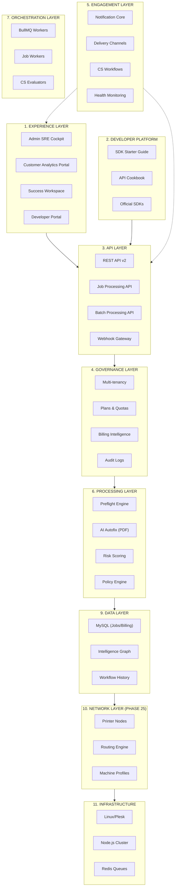

# PrintPrice Pro — Architecture Overview

This document provides a comprehensive technical and strategic overview of the PrintPrice Pro platform. It is designed for technical onboarding, partner integration, and investor presentations.

## Master Diagram: Print Intelligence Infrastructure

└──────┬────────┘             └──────┬────────┘               └──────┬────────┘             └────────┬───────┘
       │                              │                               │                               │
       └───────────────┬──────────────┴───────────────┬───────────────┴───────────────┬──────────────┘
                       │                              │                               │
                       ▼                              ▼                               ▼

┌──────────────────────────────────────────────────────────────────────────────┐
│                             EXPERIENCE LAYER                                │
├──────────────────────────────────────────────────────────────────────────────┤
│  Production App UI          Public Demo / Demo UX        Tenant Analytics   │
│  Upload → Analyze → Fix     Guided wow-flow             ROI / Usage / Risk  │
│  Verify → Delta             Investor mode               Value generated      │
└──────────────────────────────────────────────────────────────────────────────┘

┌──────────────────────────────────────────────────────────────────────────────┐
│                                API LAYER                                    │
├──────────────────────────────────────────────────────────────────────────────┤
│  Public API v2                  Admin API                 Internal Routes    │
│  /jobs                          /admin                    /preflight         │
│  /batches                       /admin/control            /health            │
│  /analytics                     /tenants                  /metrics           │
└──────────────────────────────────────────────────────────────────────────────┘

┌──────────────────────────────────────────────────────────────────────────────┐
│                           ORCHESTRATION LAYER                               │
├──────────────────────────────────────────────────────────────────────────────┤
│  Redis + BullMQ Queue Management                                            │
│  States: QUEUED → RUNNING → SUCCEEDED / FAILED / CANCELED                   │
└──────────────────────────────────────────────────────────────────────────────┘

┌──────────────────────────────────────────────────────────────────────────────┐
│                              PROCESSING LAYER                               │
├──────────────────────────────────────────────────────────────────────────────┤
│  Deterministic Engine (GS, Poppler, pdf-lib)                                │
│  Flow: Analysis → Policy Evaluation → AutoFix → Recheck → Delta             │
└──────────────────────────────────────────────────────────────────────────────┘

## Layer-by-Layer Breakdown

### 1. Experience Layer
The unified entry point for Operations (Admin Cockpit), Customers (Analytics), and Developers (Portal). It focuses on actionable insights and visual validation.

### 2. Developer Platform
The self-service integration suite. Provides the guides and tools necessary for external systems to adopt PrintPrice in hours.

### 3. API Layer
The programmable gateway. Exposes high-performance endpoints for job ingestion, batch management, and real-time status tracking.

### 4. Governance Layer
The platform's business logic foundation. Manages tenant lifecycles, plans, quotas, and granular financial/audit reporting.

### 5. Engagement Layer
The proactive lifecycle engine. Automatically monitors tenant health and manages Customer Success (CS) workflows and notifications.

### 6. Processing Layer
The core "Deterministic Engine." Performs deep structural PDF analysis, risk scoring, and policy-driven repairs (AutoFix).

### 7. Orchestration Layer
Powered by BullMQ and Redis, this layer ensures massive scalability and fault tolerance for background processing.

### 9. Data Layer
The relational and historical brain. Stores jobs, metrics, and the **Print Intelligence Graph (Phase 24)** for technical signature analysis.

### 10. Network Layer (Phase 25/26)
The industrial dispatch layer. Manages **Printer Nodes**, machine capabilities, and the **Autonomous Routing Engine** for global production optimization.

### 11. Infrastructure
The physical and server runtime environment. Built on a resilient Node.js cluster with optimized asset storage.

---

## 💡 Strategic Value Proposition (Investor Deck)

- **One-liner**: PrintPrice is the cloud infrastructure layer that reconciles modern content creation with deterministic print production requirements.
- **Defensibility**: The platform is not just a "PDF fixer"; it is a governed ecosystem combining **Document Intelligence**, **Workflow Policies**, and **ROI Analytics**.
- **Maturity**: Multi-layer stabilization including financial audits, churn simulation, and SRE-grade operational dashboards.
