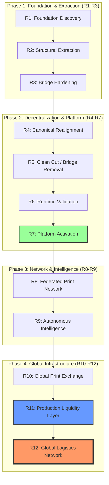

---
# PrintPrice OS Architecture Baseline
**Version**: 1.0 | **Scope**: R1 → R12 | **Date**: March 2026 | **Status**: Architecture Reference
---

# PrintPrice OS — Master Architectural Roadmap (R1 → R12)

## 1. Vision: The Global Industrial Production OS
PrintPrice OS is not just a calculation engine or a preflight tool. It is a **multi-layered industrial infrastructure** designed to coordinate the world's publishing production. It evolves through 12 specific maturity levels, moving from a localized application to a global, autonomous, and financially executable market.

## 2. Visual Master Diagram (Mermaid)

## 3. 12-Phase Roadmap with a 13-Layer Reference Stack

| Layer               | Phase | Description                                    | Key System Component     |
| ------------------- | ----- | ---------------------------------------------- | ------------------------ |
| **Application**     | Apps  | User-facing interfaces and product surfaces.   | Publisher / Printer Apps |
| **Logistics**       | R12   | Physical delivery and warehouse orchestration. | Carrier Intelligence Hub |
| **Financial**       | R11   | Automated escrow, settlement, and payouts.     | Settlement Engine        |
| **Exchange**        | R10   | Global market for production capacity.         | Liquidity Manager        |
| **Intelligence**    | R9    | Predictive modeling and SLA risk scoring.      | AI Decision Brain        |
| **Federation**      | R8    | Peer-to-peer printer node network.             | Node Registry            |
| **Operational**     | R7    | The operating execution layer.                 | Control Plane            |
| **Validation**      | R6    | Contract and runtime integrity checking.       | Boundary Enforcement     |
| **Clean Separation**| R5    | Permanent product/platform decoupling.         | Boundary Contract        |
| **Canonical Ownership**| R4 | Stable code ownership by repo/domain.          | Canonical Repositories   |
| **Transition**      | R3    | Compatibility bridges and hardening.           | Boundary Shims           |
| **Extraction**      | R2    | Moving logic into dedicated domains.           | Domain Extractors        |
| **Discovery**       | R1    | Domain mapping and dependency audit.           | Architecture Audit       |

## 4. Current Implementation Status

| Phase  | Status                  |
| ------ | ----------------------- |
| R1–R5  | Executed                |
| R6–R7  | Validated / Activated   |
| R8–R10 | Architected / Simulated |
| R11    | Designed                |
| R12    | Planned                 |

## 5. Executive Narrative: From App to Infrastructure

### The Evolution of PrintPrice OS
1.  **R1–R3 (Discovery & Extraction)**: We identified the "Platform" hidden inside the "Product" and began the surgery to separate them.
2.  **R4–R6 (Canonical Realignment & Validation)**: We defined permanent homes for all code and ensured that the system works in a distributed environment.
3.  **R7 (Activation)**: The OS was "switched on," operating as independent infrastructure for the first time.
4.  **R8–R10 (Network & Exchange)**: We added neighbors (Federation), then a Brain (Intelligence), and finally a Marketplace (Exchange).
5.  **R11–R12 (Economic & Physical Closure)**: We enabled the flow of money (Finance) and the movement of atoms (Logistics).

## 5. Strategic Comparison: What is PrintPrice OS?
*   **Like Shopify**, but for industrial publishing orchestration.
*   **Like AWS**, but for printing capacity instead of CPU cycles.
*   **Like Stripe**, but with specialized industrial escrow and settlement.
*   **Like DHL**, but with deep-tech predictive fulfillment intelligence.

## 6. Investor "One-Liner"
**PrintPrice OS transforms global industrial printing into a programmable infrastructure layer, coordinating specification, pricing, intelligence, settlement, and logistics in a single autonomous ecosystem.**

---
*Status: R1-R11 Implemented/Designed. R12 Pending.*
*Final State Goal: Global Industrial Publishing Infrastructure.*
