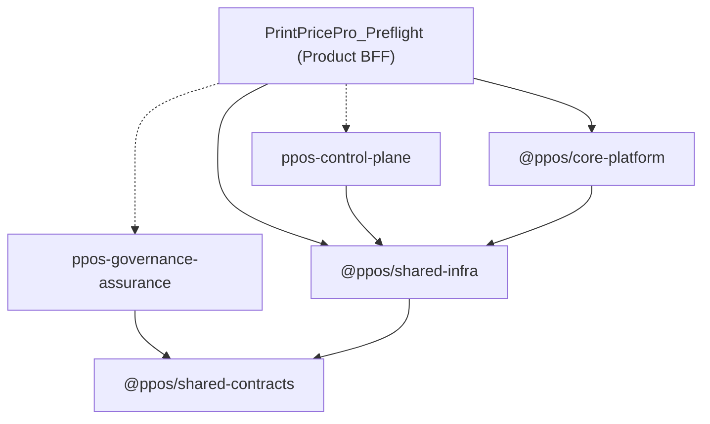

# PrintPrice OS — Dependency Graph (Phase R6)

## 1. Primary Graph

## 2. Dependency Definitions

| Repository | Primary Consumers | Upstream Dependencies |
| :--- | :--- | :--- |
| **PrintPricePro_Preflight** | End Users | `core-platform`, `shared-infra`, `control-plane`, `governance-assurance` |
| **ppos-core-platform** | Product App, Worker | `shared-infra` |
| **ppos-control-plane** | Operators, Admin UI | `shared-infra` |
| **ppos-governance-assurance** | Core Platform, Product App | `shared-contracts` |
| **ppos-shared-infra** | All Service Repos | `shared-contracts` |
| **ppos-shared-contracts** | All Repos | None (Canonical Source) |

## 3. Findings
*   **Decoupling Status**: The Product App has been successfully detached from local runtime ownership.
*   **Direct Coupling**: Some direct relative path imports remain for non-NPM-linked components (e.g., `governance-assurance`), but they follow the canonical folder structure.
*   **Circular Dependencies**: None detected.
