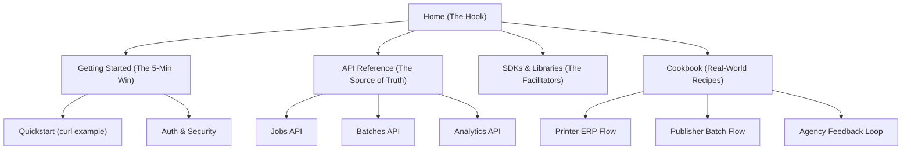

# Developer Portal: Visual Architecture

The Developer Portal (`developers.printprice.pro`) is the terminal for all external technical adoption. It must follow a "Low Friction / High Authority" design.

## 🏛️ Content Hierarchy

## 🎨 Visual Principles (Stripe/Vercel Style)

1. **The "Two-Column" API Reference**:
   - **Left**: Deep technical documentation, params, and descriptions.
   - **Right**: Live code snippets (Node, Python, PHP, Java) that change based on the selected endpoint.
   
2. **Interactive Quickstart**:
   - A hero section where a developer can paste their API Key and run a `curl` directly from the browser against a demo file.

3. **Status Banner**:
   - Global platform health status integrated into the header.

4. **"Copy-Paste" Friendly**:
   - Every code block must have a one-click copy button and a "Try in Postman/Insomnia" link.

## 🚦 Navigation Experience

- **Sticky Sidebar**: Nested navigation (Concepts -> API -> Guides -> Examples).
- **Global Command Bar (Cmd + K)**: Instant search for endpoints, error codes, and tutorials.
- **Contextual Help**: Hovering over API parameters shows a tool-tip with types, ranges, and validation rules.
