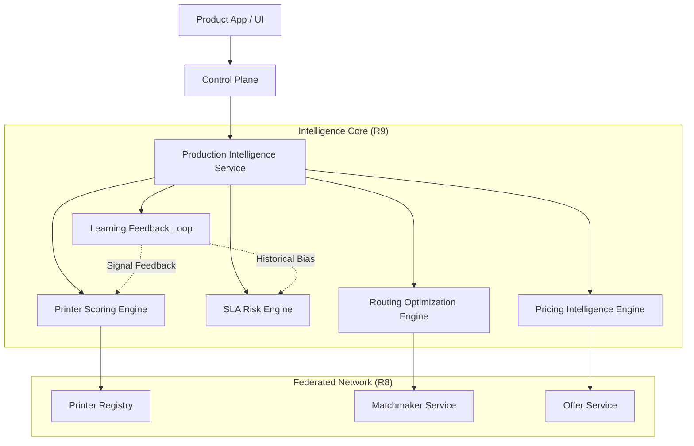

# Autonomous Intelligence Architecture — PrintPrice OS

**Layer**: Decision Intelligence (R9)
**Status**: DESIGNED
**Scope**: Platform-wide predictive orchestration.

## 1. Intelligence Service Topology
The intelligence layer operates as a **cross-cutting orchestration surface** above the Federated Print Network (R8).

## 2. Core Intelligent Services

| Service | Responsibility | Canonical Hook |
| :--- | :--- | :--- |
| **productionIntelligenceService** | Central entry point for all decision logic. | `MatchmakerService` |
| **printerScoringEngine** | Ranks nodes by capability + historical performance. | `RegistryService` |
| **slaRiskEngine** | Predicts probability of delivery / quality failure. | `DispatchService` |
| **routingOptimizationEngine** | Calculates optimal utility (Price + Time + Risk). | `OfferMarket` |
| **pricingIntelligenceEngine** | Detects anomalies and strategic pricing opportunities.| `OfferMarket` |
| **learningFeedbackService** | Ingests post-production signals to train models. | `ProductionState` |

## 3. Data Inputs & Context
- **Static**: Machine technical capabilities, location, SLA tier.
- **Dynamic**: Real-time queue depth, recent heartbeat latency.
- **Historical**: Success/failure rates, delay statistics, quality audit signals.
- **Network**: Market average prices, regional congestion markers.

## 4. Decision Lifecycle
1. **Request**: System receives a job intent.
2. **Expansion**: Intelligence layer enriches the request with risk and reliability markers.
3. **Execution**: Optimization engine calculates best candidates.
4. **Validation**: Governance guardrails check the decision.
5. **Observation**: Actual outcome is recorded to update future weights.
