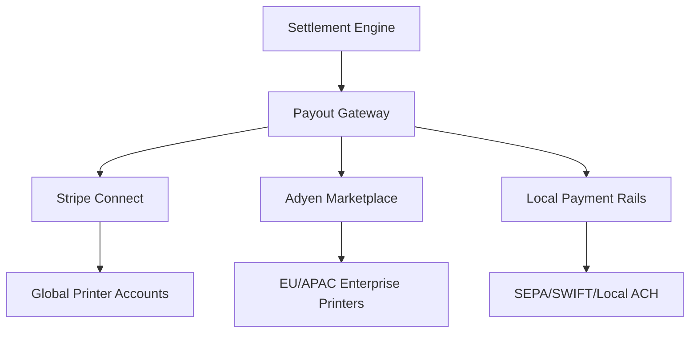

# Printer Payout Infrastructure

## Overview
The **Printer Payout Infrastructure (PPI)** is the last mile of the financial flow. It ensures that after the Autonomous Settlement Engine has calculated the breakdown, the actual physical transmission of funds reaches the printer's regional bank account or industrial wallet.

## Payout Architecture
The system utilizes a **Multi-Rail Gateway** to select the most efficient route based on the printer's location and payout preferences.



## Data Model: PrinterPayout
```json
{
  "printer_id": "prn-005",
  "payout_account": "iban-xxxx-xxxx-xxxx",
  "payout_currency": "EUR",
  "payout_amount": 8450.50,
  "payout_status": "DISPATCHED",
  "settlement_reference": "settle-uuid-445",
  "estimated_arrival": "2026-03-16T14:30:00Z"
}
```

## Supported Payout Channels
1. **SEPA Instant**: 10-second settlement for EU-based printers.
2. **Stripe Connect**: Managed onboarding and automated payouts for SMB printers.
3. **SWIFT**: High-value global transfers for large industrial hubs.
4. **Local Rails**: Integrations with specific regional systems (e.g., PIX in Brazil, FedNow in US).

## Simulation of Payout Execution
1. **Verification**: ASE sends `RELEASE` command.
2. **KYC/KYB Check**: Gateway verifies that the printer's business profile is active and verified.
3. **Channel Selection**: System detects `EUR` destination -> Selects `SEPA Instant`.
4. **Execution**: Payout API called.
5. **Confirmation**: Webhook received from bank -> `payout_status` updated to `PAID`.

## Security Controls
- **Sanction Screening**: Every payout is checked against global sanction lists (OFAC, etc.) automatically.
- **Account Binding**: Printers can only receive payouts into bank accounts that match their registered legal business identity.
- **Dual Approval**: Payouts exceeding a threshold (e.g., >$50k) require a secondary system audit before release.

---
*PrintPrice OS — Production Liquidity Layer Infrastructure*
