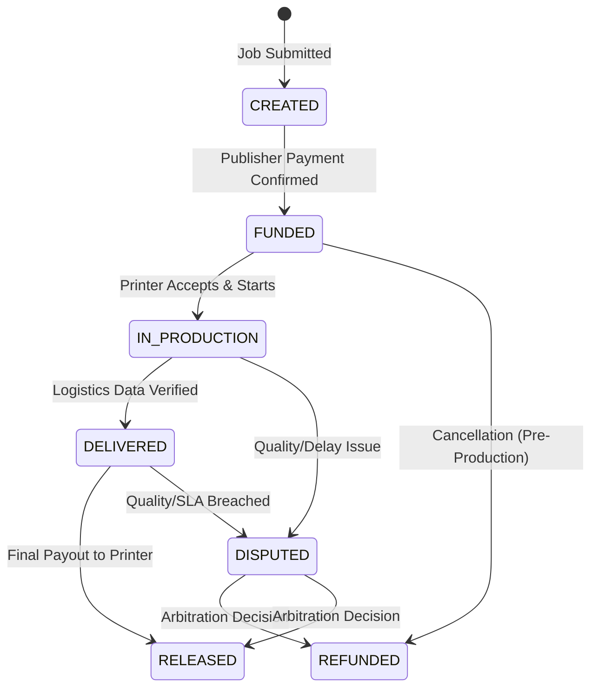

# Production Escrow Architecture

## Overview
The **Production Escrow System** is the financial cornerstone of the PrintPrice OS ecosystem. It ensures trust and security in a global, decentralized market by locking funds at the start of a production cycle and releasing them only upon verified delivery. This "Proof of Production" settlement model protects both Publishers (from non-delivery) and Printers (from non-payment).

## Escrow Lifecycle
The escrow process follows a strict state machine to maintain financial integrity across international borders.



## The Escrow Object
Each production job is mapped to a unique `ProductionEscrow` object that serves as the "Financial Digital Twin" of the physical job.

```json
{
  "escrow_id": "esc-9902-88ax",
  "job_id": "job-5501-v2",
  "publisher_id": "pub-001",
  "printer_id": "prn-442",
  "locked_amount": 12500.00,
  "currency": "EUR",
  "exchange_fee": 375.00,
  "printer_payout": 12125.00,
  "escrow_status": "FUNDED",
  "created_at": "2026-03-15T10:00:00Z",
  "funded_at": "2026-03-15T10:05:00Z",
  "verification_requirements": [
    "Carrier_Confirmation",
    "Preflight_Match_Check",
    "Proof_of_Delivery"
  ]
}
```

## Status Definitions

| Status | Description |
| :--- | :--- |
| **CREATED** | Escrow record initialized, awaiting publisher funding. |
| **FUNDED** | Funds successfully captured and held by the settlement bank/PSP. |
| **IN_PRODUCTION** | Printer has committed resources; funds are legally locked. |
| **DELIVERED** | Shipment confirmed via integrated logistics tracking. |
| **RELEASED** | Funds transferred to the Printer's payout account (minus fees). |
| **REFUNDED** | Funds returned to the Publisher due to cancellation or dispute. |
| **DISPUTED** | Escrow frozen pending manual or AI arbitration. |

## Implementation Strategy
- **Bank-Agnostic Locking**: While primarily using Stripe Connect for initial rollout, the architecture allows for local industrial bank integrations (e.g., SEPA SCT Inst, FedNow).
- **Time-Locked Clauses**: If a delivery is not verified within `SLA_PROMISE + 48h`, the system triggers an automatic audit trail for potential refund/dispute.
- **Smart Contract Ready**: The logic is designed to be portable to DLT structures if the network moves toward a fully decentralized settlement later.

---
*PrintPrice OS — Production Liquidity Layer Infrastructure*
