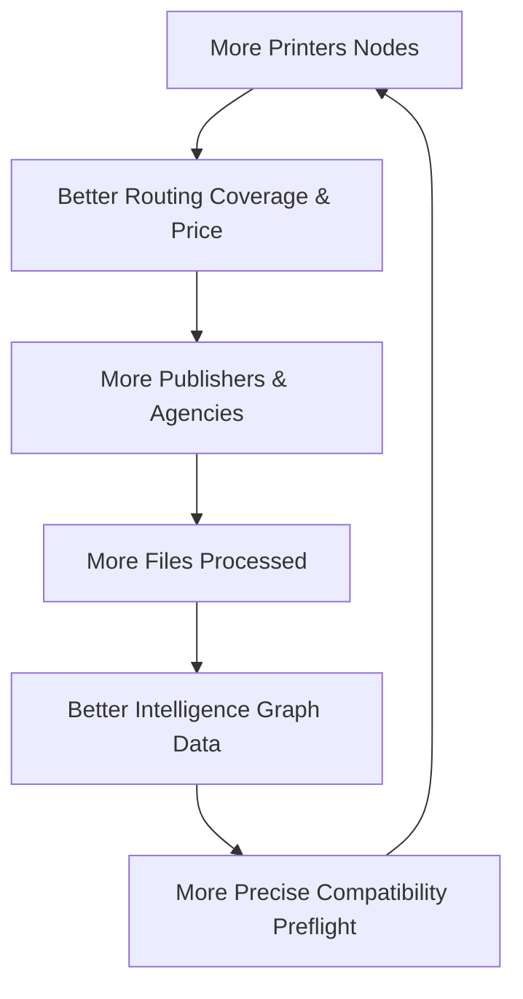

# PrintPrice Economic Flywheel — Growth Strategy

The value of PrintPrice Pro grows exponentially with every participant in the network. This "Flywheel Effect" creates a defensible market position and a powerful Data Moat.

## The Network Flywheel

### 1. Better Routing & Price
As more printers join, geographical distance decreases and price competition optimizes costs for the publishers.

### 2. More Files → Better Data
Every PDF processed by the **Processing Engine** enriches the **Print Intelligence Graph**. The system learns which technical signatures (TAC, fonts, etc.) are most common and which cause the most production failures.

### 3. Precision Preflight
Increased data allows for "Predictive Preflight." The platform can warn a publisher: *"This specific file has a 95% success rate on Machine X, but only 40% on Machine Y."*

### 4. Defensibility (The Data Moat)
Copying the software is possible; copying 10 years of industrial production data (file signatures matched to machine results) is nearly impossible. This is the **Stripe of Print** strategy.

---
*PrintPrice: Fueling growth through industrial data intelligence.*
