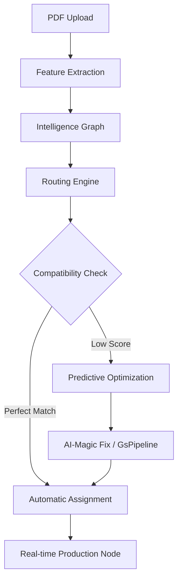

# PrintPrice Autonomous Routing Engine — Phase 26 Vision

Having established the **Intelligence Graph (Phase 24)**, the next evolution is to transform "Knowledge" into "Autonomy." Phase 26 focuses on the **routing layer**, allowing the platform to decide *where* and *how* a file should be produced without human intervention.

## 1. The Autonomous Flow
The Routing Engine acts as a "Market Maker" between PDF requests and Printer capabilities.



## 2. Decision Engine Components

The Routing Engine is composed of three specialized sub-engines:

### 1️⃣ Compatibility Engine
Evaluates structural alignment between the PDF and the hardware.
- **Input**: `print_features`, `machine_profiles`, `paper_profiles`.
- **Output**: `compatibility_score` (0-100).

### 2️⃣ Network Discovery
Identifies available supply nodes capable of handling the configuration.
- **Input**: `printer_nodes`, `printer_machines`, `status_telemetry`.
- **Output**: `candidate_printers[]`.

### 3️⃣ Routing Optimizer
Ranks candidates using a multi-vector heuristic.
```text
routing_score = (compatibility * 0.5) + (price * 0.2) + (distance * 0.2) + (capacity * 0.1)
```

## 3. High-Integrity Routing API (Phase 26.1)

Introduction of the routing recommendation endpoint:

```http
POST /api/v2/routing/recommend
Content-Type: application/json

{
  "job_id": "job_123",
  "paper_id": "paper_456",
  "policy_id": "policy_789"
}
```

## 4. Business Impact
- **Zero-Touch Prepress**: Files route themselves directly to the press.
- **Dynamic Load Balancing**: Distributing work across a global network based on real-time machine status.
- **Predictive ROI**: Knowing the exact cost and success probability before hitting the press.

---
*Transforming the print industry into a predictable digital utility.*
