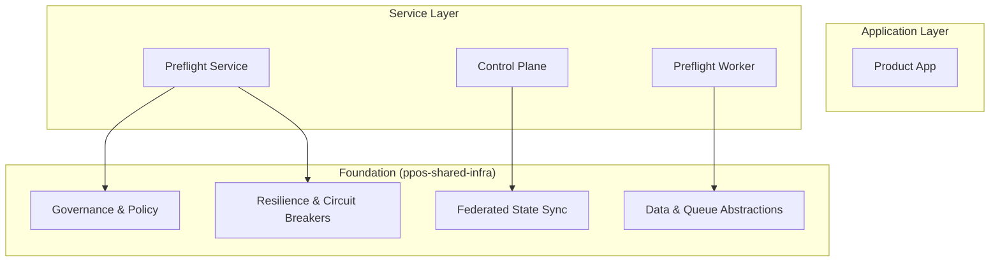

# PrintPrice OS — Shared Infrastructure (`ppos-shared-infra`)

## 1. Repository Role
The `ppos-shared-infra` repository serves as the **Operational Backbone** of the PrintPrice OS ecosystem. It provides a standardized set of libraries and services that handle cross-cutting concerns such as data persistence, asynchronous messaging, governance, and federated state synchronization.

## 2. Architecture Position
Inside the PrintPrice OS fabric, Shared Infra sits at the foundational layer. All other services including `preflight`, `control-plane`, and `worker` nodes consume this repository as a shared dependency to ensure consistent behavior across regional boundaries.



## 3. Repository Structure
```text
packages/
  comms/        # Email/Webhook notification services
  data/         # MySQL (db) and Redis (queue) abstractions
  federation/   # Regional registries and policy resolvers
  fss/          # Federated State Sync protocols
  governance/   # Policy enforcement and resource governance
  ops/          # Metrics, Secret Manager, Provisioning
  region/       # Regional context and multi-region helpers
  resilience/   # Circuit breakers and retry managers
index.js        # Main entry point (facade)
package.json
```

## 4. Responsibilities
- **Data & Lifecycle**: Standardized database and queue connectors.
- **Federated Governance**: Enforcement of regional and global production policies.
- **Resilience**: Integrated circuit breakers and retry management for distributed calls.
- **Multi-Region Coordination**: Federated State Sync (FSS) protocols (Drift, Convergence, Replay).
- **Observability**: Shared metrics, secret management, and operational logging.

## 5. Dependency Relationships
- **Dependent Services**: `ppos-preflight-service`, `ppos-preflight-worker`, `ppos-control-plane`.
- **External Dependencies**: Redis (for FSS and Queuing), MySQL (for persistence).

## 6. Local Development

### Installation
```bash
npm install
```

### Usage
This library is consumed via the `@ppos/shared-infra` namespace.

```javascript
const { db, queue, policyEnforcementService } = require('@ppos/shared-infra');

// Example: Evaluating a policy
const decision = await policyEnforcementService.evaluate({
    tenantId: 'tenant-123',
    operation: 'print_heavy_asset'
});
```

## 7. Environment Variables
| Variable | Description | Default |
| :--- | :--- | :--- |
| `DATABASE_URL` | MySQL Connection String | N/A |
| `REDIS_HOST` | Redis Hostname | `127.0.0.1` |
| `REDIS_PORT` | Redis Port | `6379` |
| `PPOS_REGION_ID` | Current Regional ID | `global` |

## 8. Version Baseline
**Current Version**: `v1.9.0` (Federated Health & Decoupling Pass)

---
© 2026 PrintPrice. Distributed Execution Infrastructure.