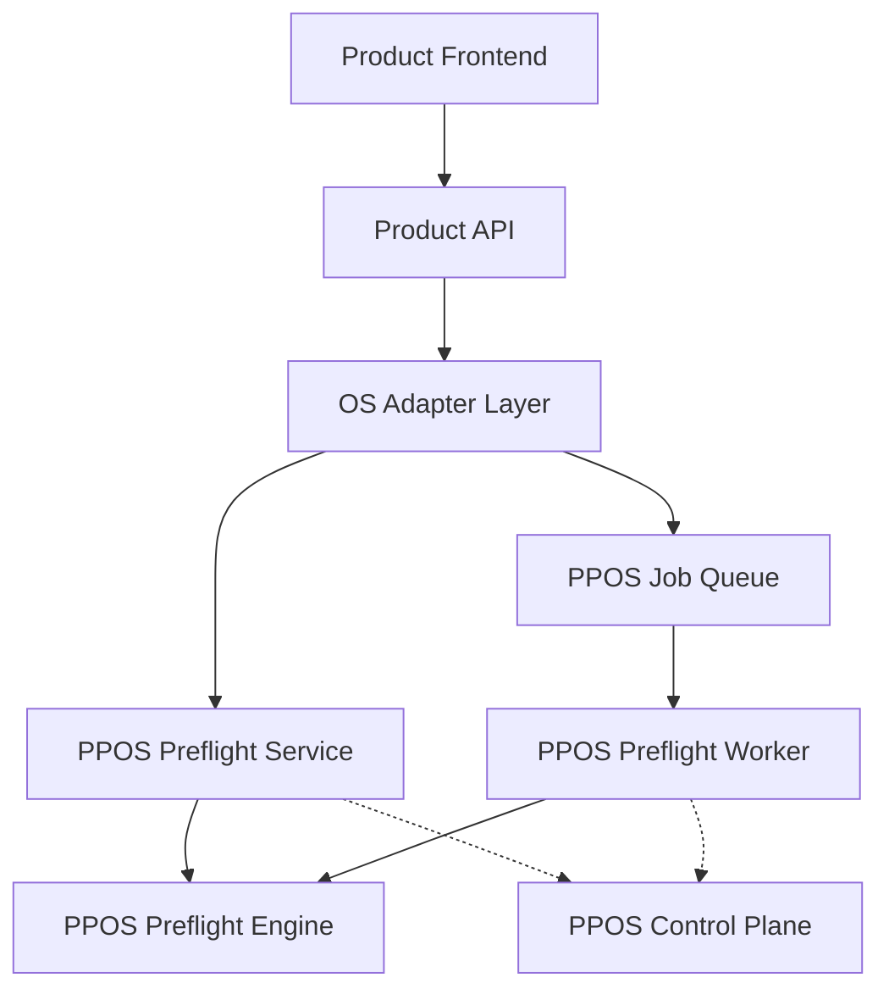

# PrintPrice OS & Product Architecture — Master Baseline (V1.9.0)

## 1. Structural Overview
The ecosystem is now split into six canonical repositories, enforcing a strict separation between industrial infrastructure (OS) and client application (Product).

### A. PrintPrice OS (PPOS) Core
1.  **`ppos-shared-infra`**: Operational services (DB, Queue, Auth, Resilience).
2.  **`ppos-control-plane`**: Federated health dashboard and observability.
3.  **`ppos-preflight-engine`**: Deterministic industrial analysis kernel.
4.  **`ppos-preflight-service`**: HTTP orchestration and API abstraction.
5.  **`ppos-preflight-worker`**: Asynchronous job execution and scaling.

### B. PrintPrice Product
1.  **`PrintPricePro_Preflight`**: The client application. It no longer owns engine logic; it consumes the OS via adapters.

## 2. Integration Data Flow

## 3. Communication Protocols
- **Sync**: HTTP/JSON via `axios` in the adapter layer.
- **Async**: Centralized Redis-backed `bullmq` managed by the OS.
- **Shared Utilities**: Linked via `npm` dependency (using `file:` stubs for local dev).

## 4. Release Status
- **Current Phase**: V1.9.0 (Federated Health & Decoupling).
- **Validation Status**: **STAGING_VERIFIED**.
- **Source of Truth**: All core logic has been moved out of the product "quarry" and sits in independent OS repos.

## 5. Next Phase Roadmap (V1.9.1)
- **Hardening**: Zero-trust security between product/OS.
- **Failover**: Multi-region regional failover policies.
- **Replay**: Durable state recovery for worker jobs.
