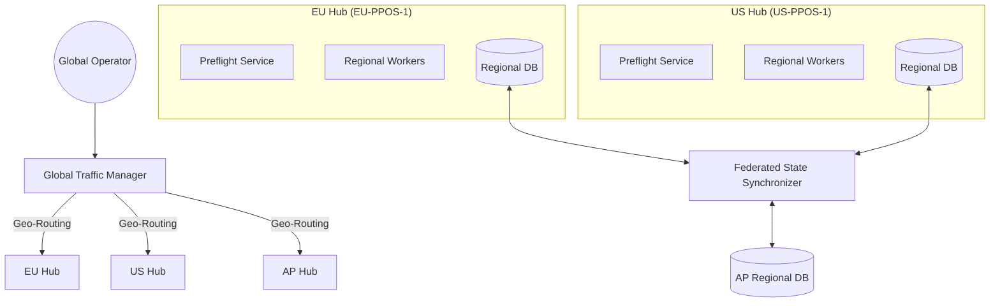

# Multi-Region Architecture Blueprint — PrintPrice OS

## 1. Executive Summary
This blueprint defines the transformation of PrintPrice OS from a single-region industrial platform to a globally distributed, high-availability ecosystem. The architecture ensures low-latency job processing and organizational resilience through regional isolation and a federated state synchronization layer.

## 2. Regional Topology
| Region Code | Location | Purpose | Traffic Profile |
| :--- | :--- | :--- | :--- |
| `EU-PPOS-1` | Frankfurt, EU | Primary Production Hub | High Volume / High Governance |
| `US-PPOS-1` | Northern Virginia, US | Strategic Hub | High Concurrency |
| `AP-PPOS-1` | Singapore, APAC | Logistics / Edge Hub | Low Latency / Regional Compliance |

## 3. High-Level Architecture

## 4. Component Definition

### 4.1 Global Traffic Manager (GTM)
- **Technology**: Cloudflare Workers / AWS Route 53 Geolocation.
- **Responsibility**: Routes users to the nearest regional hub and detects regional outages for failover.

### 4.2 Federated State Synchronizer (FSS)
- **Mechanism**: Event-driven replication (Redis Streams / Kafka).
- **Synchronized Entities**: 
    - Organizational Registry (Tenants, Orgs).
    - Global Policies (SLA, Compliance).
    - User Identity (SSO/IAM).
- **Isolation**: Job data (temp files, PDFs) **never** leaves the region unless a failover is manually triggered.

### 4.3 Regional Failover Controller (RFC)
- **Policy**: If an entire region goes down, the RFC triggers a "Failover Intent" to the nearest healthy region.
- **Data Migration**: Only metadata is synchronized; assets are re-uploaded to the failover region.

## 5. Deployment Hardware Requirements (Per Region)
- **Database**: Multi-AZ RDS / Galera Cluster.
- **Cache**: Regional Redis Cluster.
- **Compute**: Distributed Node.js instances (K8s pods).
- **Storage**: Regional S3 Buckets / EFS.

## 6. Security & Data Residency (GDPR/PIPEDA)
- Regional isolation ensures that jobs submitted in the EU stay in the EU.
- Only non-PII metadata (Job IDs, Status) is visible in the Global Control Plane.

## 7. Next Steps: Regional Pilot
1. **Phase 1**: Implement `RegionFilter` in `SharedInfra` for tenant-aware routing.
2. **Phase 2**: Deploy a mock `US-PPOS-1` hub in Docker for low-latency testing.
3. **Phase 3**: Integrate FSS for synchronizing the Organizational Registry.
