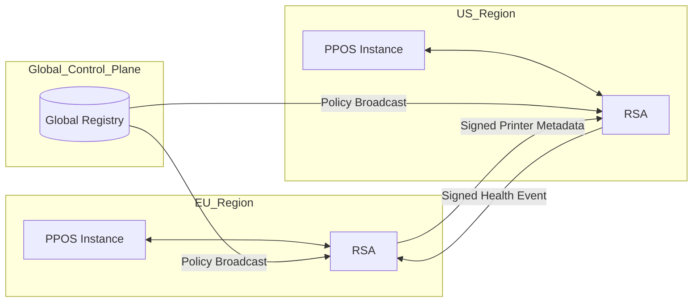

# FSS Architecture Model — PrintPrice OS

## 1. Chosen Model: Hybrid Federated Topology

PrintPrice OS will utilize a **Hybrid Topology** consisting of a **Global Control Plane (GCP)** for static/policy state and **Signed Regional Event Streams (SRES)** for dynamic coordination.

### Rationale
- **Hub-and-Spoke** is too fragile (Single Point of Failure for global execution).
- **Pure Mesh** is too complex to audit for deterministic governance.
- **Hybrid** provides the best balance: Centralized trust and policy with decentralized, autonomous execution.

## 2. Structural Components

### 2.1 Global Governance Registry (GGR)
- **Role**: Store of truth for Organizations, Tenants, and signed Policies.
- **Location**: Primary active region (e.g., `EU-PPOS-1`).
- **Distribution**: Read-only replicas in every secondary region.

### 2.2 Regional Synchronization Adapters (RSA)
- **Role**: Interface between the local PPOS instance and the FSS backbone.
- **Functions**: Metadata filtration, event signing, and replay management.

### 2.3 Signed Event Bus (SEB)
- **Technology**: Redis Streams / NATS JetStream (Cross-Region).
- **Security**: Mutual TLS (mTLS) + Ed25519 payload signing.

## 3. Communication Logic

## 4. Replication Flow
1. **Genesis**: A change occurs (e.g., Printer Node added in US).
2. **Filtration**: `US-RSA` verifies the entity is `GLOBAL` metadata and redacts any regional secrets.
3. **Signing**: `US-RSA` signs the payload with the regional private key.
4. **Broadcast**: Event published to the `SEB`.
5. **Consumption**: `EU-RSA` validates signature and merges the metadata into the EU regional cache.

## 5. Decision: Eventual vs Strong Consistency
- **Strong Consistency**: For organizational membership and security revocation (via Hub-based sequence numbers).
- **Eventual Consistency**: For health metrics and capacity telemetry (LWW - Last Writer Wins).
