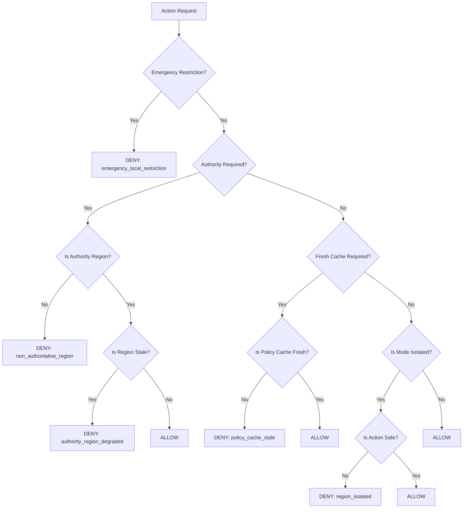

# Runtime Policy Resolver
# PrintPrice OS — Multi-Region Runtime Activation

The `RuntimePolicyResolver` is the central component that translates architectural governance rules into real-time execution decisions.

## 1. Responsibilities

* **Authority Validation:** Ensures that global mutations only originate from the designated `Authority Region`.
* **Staleness Tracking:** Monitors synchronization lag and triggers `DEGRADED` or `ISOLATED` modes based on thresholds.
* **Cache Integrity:** Checks the freshness of the local policy cache before allowing sensitive operations.
* **Emergency Overrides:** Evaluates `EmergencyRestrictionManager` overlays that take precedence over normal logic.
* **Deterministic Results:** Returns structured decision objects including the `mode`, `reason`, and `restriction_source`.

## 2. Shared Module

Location: `ppos-shared-infra/packages/federation/RuntimePolicyResolver.js`

## 3. Decision Logic Flow



## 4. Execution Modes

| Mode | Trigger | Effect |
| :--- | :--- | :--- |
| **NORMAL** | Sync Lag < 5m | All actions permitted. |
| **DEGRADED** | Sync Lag 5m - 30m | Warnings emitted; global mutations blocked. |
| **STALE** | Sync Lag 30m - 2h | Authority functions suspended; local intake permitted. |
| **ISOLATED** | Sync Lag > 2h | Outbound federation blocked; strict local-only safety mode. |
| **EMERGENCY** | Manual Trigger | Explicit restrictive overlay applied. |

## 5. Usage Example

```javascript
const { runtimePolicyResolver } = require('@ppos/shared-infra');

const decision = runtimePolicyResolver.isActionAllowed('policy_publish');

if (!decision.allowed) {
    console.error(`Action Blocked: ${decision.reason} (Mode: ${decision.mode})`);
    // Return 403 / 503 to client
}
```
