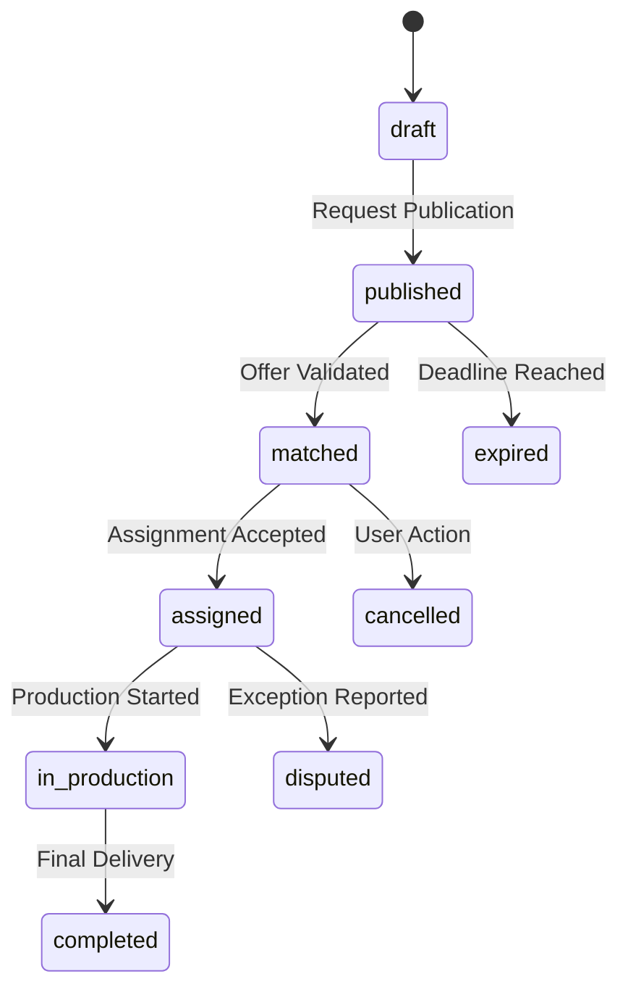
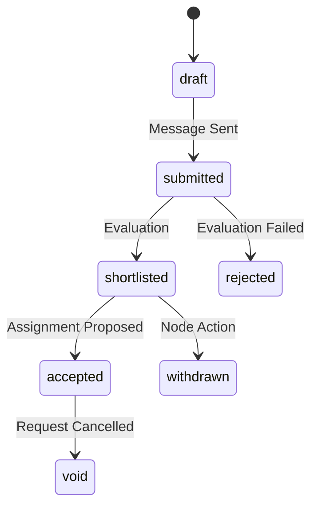
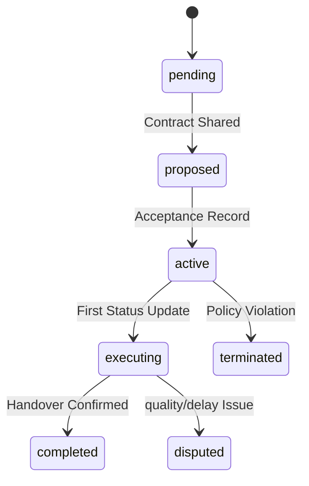

# FEP State Machines

## 1. Entity Lifecycles
FEP entities follow deterministic state transitions managed by `fepStateTransitionResolver`.

### 1.1 Production Request Lifecycle

### 1.2 Production Offer Lifecycle

### 1.3 Assignment Lifecycle

## 2. Transition Rules
Each transition MUST define:
- **Trigger**: The FEP message type or system event.
- **Actor**: The specific node authorized to initiate the change.
- **Preconditions**: Governance and trust assertions required.
- **Evidence**: Mandatory links to `evidenceEnvelope`.
